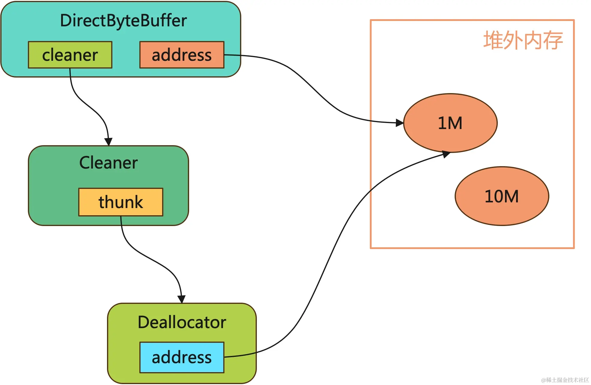

# 关于Netty内存管理

>Netty使用的堆外内存不受JVM限制，可能会导致申请内存超出系统限制，从而导致os kill。

## 问题表现

从「阿里云开发者」公众号文章，[8G的容器Java堆才4G怎么就OOM了？](https://mp.weixin.qq.com/s/wdgNL0GUsqPpRBoPh7yBSw) ，基本可以了解到Netty自己管理的堆外内容不受控制，且一般jvm监控无法发现它。

## 原因分析

参考[死磕 Netty 之内存篇：探索那个不为人知的堆外内存](https://juejin.cn/post/7379117970796691510) 可以大致了解Netty是如何申请堆外内存的。

这里不过多介绍其他可能情况。使用Java 8且Netty配置参数默认的情况下，Netty是通过类似`Unsafe#allocateMemory()` API申请堆外内存的，且这些内存无**Cleaner**关联。

如果是通过`ByteBuffer.allocateDirect()`方式申请的就有**Cleaner**，如下图



因此，Netty的表现 
- Netty申请的堆外内存无法监控 
- 自己管理堆外内存无法通过GC进行回收
- Netty申请的堆外内存可能会超过系统限制

## 实验分析

这部分简化过程处理，只说结论，参考以下代码，
```
// -XX:MaxDirectMemorySize=10M
// Netty和应用可以同时申请10M堆外内存
PooledByteBufAllocator allocator = PooledByteBufAllocator.DEFAULT;
allocator.directBuffer(10 * 1024 * 1024);
ByteBuffer.allocateDirect(10 * 1024 * 1024);

// Netty 堆外内存使用情况
PooledByteBufAllocatorMetric metric = allocator.metric();
metric.usedDirectMemory();
```

Netty和应用可以同时申请10M堆外内存，至少说明了Netty使用的堆外内存与应用使用的堆外内存是分开统计的。

另外虽然JVM无法监控的Netty的内存使用情况，但是它提供了metric，通过metric是可以暴露相关指标的。为了获取这些指标可以考虑接入jmx、Prometheus或者写一个Controller接口。

## 使用建议

通过设定MaxDirectMemorySize参数可以限制Netty的堆外内存使用上限。
如无必要不要定制ClassLoader加载Netty，这样会导致产生多个PooledByteBufAllocator实例（虽然PooledByteBufAllocator使用了单例模式，但是不同ClassLoader的类是不同的）。
针对Netty堆外内存使用情况进行监控，了解Netty为何需要很多堆外内存，可能与系统的吞吐量有关，可能与Socket通信消息体过大有关。
