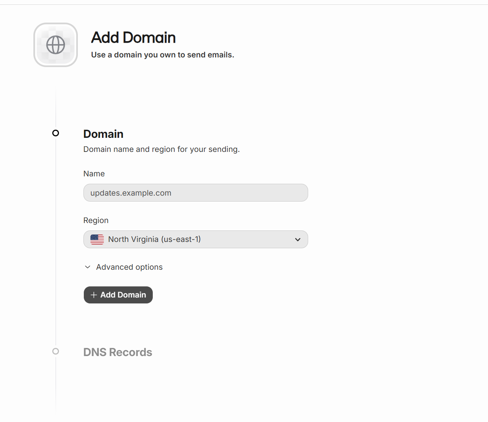
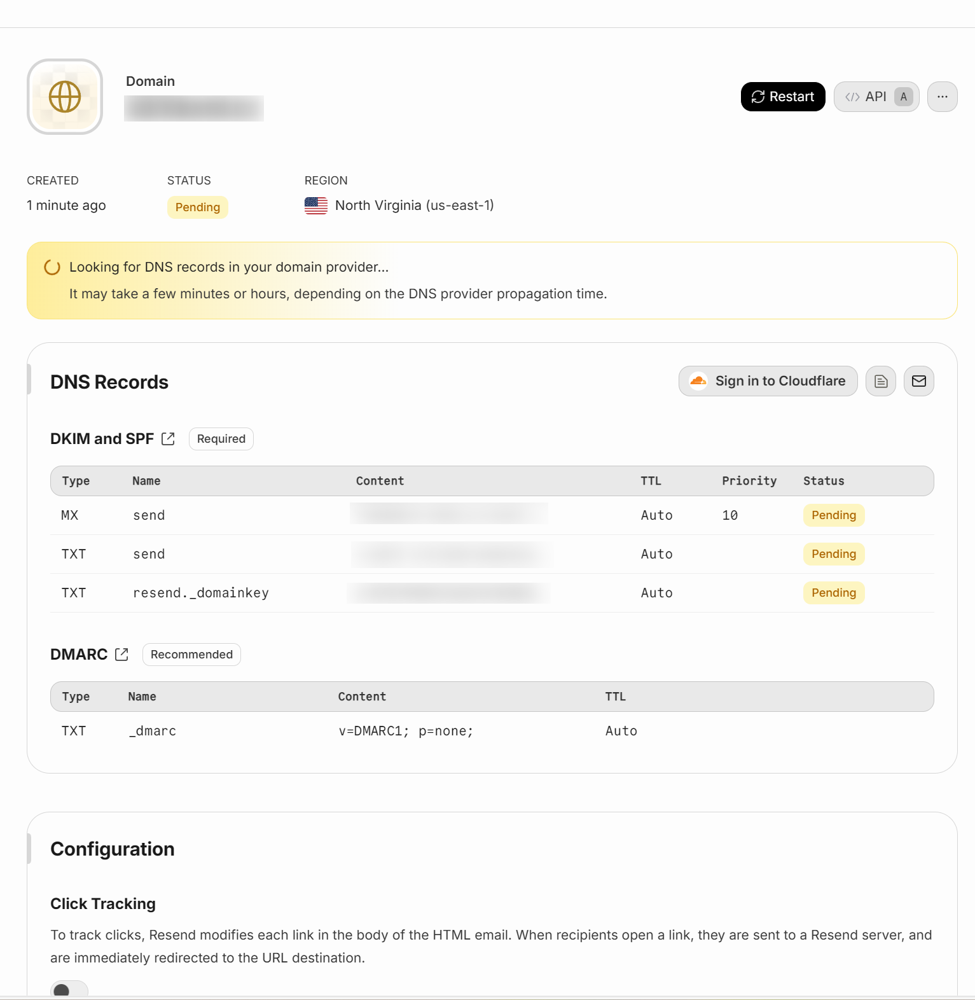
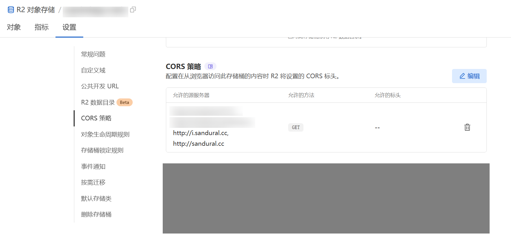

> 经过多次的调研，本人打算利用`cloudflare workers` 实现一个全栈化项目的部署，技术选型前端使用`Vue`，后端除了`cloudflare workers`全家桶，还是用`Hono`，`better-auth`以及`drizzle`。

## 初始化框架

### 搭建全栈化项目

```
npm create cloudflare@latest -- cards --framework=vue
```

初始化后，整个工程已经配置好`vite.config.ts`， 规划好前端代码部分在`src`目录 以及后端代码部分在`server`目录。
整个项目可以看作以前端项目为主体，后端项目为辅的设计。

### 引入better-auth
这一步的目的是使用`better-auth`的账号及登录方面的表设计。主要涉及的表有 `user` `account` `verification`，另外和会话相关的我们开启次级存储，使用`cloudflare workers`的 `KV`。同时，`better-auth` 提供了完整的账号管理功能，以及集成第三方登录的能力。另外它也提供了前端使用的SDK。

配置`better-auth` 密钥，这一步和密码hash 有关，具体源码没有深究
```
BETTER_AUTH_SECRET=
```

如果是普通的数据库，不像`cloudflare workers` 这样子需要首先bindging，然后通过http 接口触发，再从context 中获取，那么配置使用`better-auth` 挺简单的。

配置好DB，
```ts
import { betterAuth } from "better-auth";
import { drizzleAdapter } from "better-auth/adapters/drizzle";
import { db } from "@/db"; // your drizzle instance
 
export const auth = betterAuth({
    database: drizzleAdapter(db, {
        provider: "pg", // or "mysql", "sqlite"
    }),
});
```
使用cli 工具，`npx @better-auth/cli generate` 生成schema，`npx @better-auth/cli migrate` 在数据库中创建表。


由于`cloudflare workers` 的特殊性，这里采用网上的开源方案[cf-script](https://github.com/Thomascogez/cf-script)，先折衷搞到shema，

```ts
import { getAdapter } from "better-auth/db";
import { writeFile } from "node:fs/promises";
import { resolve } from "node:path";
import { initBetterAuth } from "../server/lib/auth";
import { generateDrizzleSchema } from "./_vendors/drizzle-generator";

export default async (env: unknown) => {
	const betterAuth = initBetterAuth(env);

	const output = await generateDrizzleSchema({
		adapter: await getAdapter(betterAuth.options),
		options: betterAuth.options,
		file: resolve(import.meta.dirname, "../db/schema/better-auth-schemas.ts")
	});

	await writeFile(output.fileName, output.code ?? "");

	console.log(`Better auth schema generated successfully at (${output.fileName} 🎉`);
};
```

然后初始化BetterAuth对象是在全局路由中处理，
```ts
// server/index.ts
type Bindings = {
  DB: D1Database; // Assuming your D1 binding is named 'DB'
  KV: KVNamespace; // Assuming your KV binding is named 'KV'
};

// 扩展 Context 的变量类型
interface Variables {
  db: ReturnType<typeof drizzle>;
}
const app = new Hono<{ Bindings: Env; Variables: Variables }>()

// 全局 middleware 示例
app.use('*', async (c, next) => {
  // 这里可以做一些全局处理，比如日志、鉴权等
  // console.log('Global middleware: 请求路径', c.req.path)
  const db = drizzle(c.env.DB)
  // console.log('Database connection established:', db)
  c.set('db', db) // 挂载 db 实例到 Context
  await next()
})
```
上面的处理，已经在全局开始设置了`db` 实例，然后再某些路由handler 中处理的时候，调用下面的方法就可以拿到`betterAuth`实例。

```ts
export const auth = (env: Env): ReturnType<typeof betterAuth> => {
  const db = drizzle(env.DB);

  return betterAuth({
    ...betterAuthOptions,
    database: drizzleAdapter(drizzle(env.DB), {
      provider: "sqlite",
      schema: {
        user: schema.userTable,
        account: schema.accountTable,
        session: schema.sessionTable,
        verification: schema.verificationTable,
      },
    }),
    secondaryStorage: {
			get(key) {
				return env.KV.get(key);
			},
			set(key, value, ttl) {
				return env.KV.put(key, value, { expirationTtl: ttl });
			},
			delete(key) {
				return env.KV.delete(key);
			}
		},
    baseURL: env.BETTER_AUTH_BASE_URL,
    secret: env.BETTER_AUTH_SECRET,
    emailAndPassword: {    
      enabled: true
    },
    // Additional options that depend on env ...
  });
};
```

比如说登录，

```ts
authRoutes.post('/login', async (c) => {
  const db = c.get('db') // 确保 db 实例已挂载到 Context
  const requestBody = await c.req.json();
  const JWT_SECRET = c.env.JWT_SECRET!; 
    try {
      const { email, password, username } = requestBody;
      
      // 支持email或username字段
      const loginIdentifier = email || username;
  
      // 验证输入
      if (!loginIdentifier || !password) {
        return c.json({
          success: false,
          message: '邮箱/用户名和密码都是必填项'
        }, 400);
      }
      const resp = await auth(c.env).api.signInEmail({
        body: {
          email: requestBody.email,
          password: requestBody.password,
        }
      })
      if (resp && resp.user) {
        const user = resp.user;
        // 生成JWT token
        const token = await generateToken(JWT_SECRET, user.id);
              // 获取新创建的用户
        const existingUser = await db.select().from(schema.userTable).where(eq(schema.userTable.id, user.id)).limit(1).get();
  
        return c.json({
          success: true,
          message: '登录成功',
          data: {
            user: {
              id: user.id,
              username: user.name,
              email: user.email,
            },
            token
          }
        });
      }
    return c.json({
        success: false,
        message: '用户名或密码错误'
      }, 400);
    } catch (error) {
      console.error('Login error:', error);
      return c.json({
        success: false,
        message: '登录失败，请稍后重试',
        error,
      }, 500);
    }
});
```

使用`betterAuth`实例的API方法比自己手写各类处理：校验账密、创建会话要简单多了。`betterAuth`提供了丰富的API，比如登录 `signInEmail`， 注册`signUpEmail` 等等。

## Hono

可以看出前面演示的代码使用了`Hono`，他比原生的`cloudflare workers` 写起来更加舒服一点，各方面支持都非常完善，所以建议采用这个实现路由管理。它的中间件设计和`express` 是可以类比的，这在拦截请求判断是否登录授权用户方面非常方便。

```ts
// server/middlewared/auth.ts
// 验证JWT token的中间件
export const authenticateToken = async (c: Context, next: Next) => {
  const db = c.get('db'); // 确保 db 实例已挂载到 Context
  // JWT 密钥，建议从环境变量中加载
  const JWT_SECRET = c.env.JWT_SECRET!; 
  try {
    const authHeader = c.req.header('Authorization');
    const token = authHeader?.split(' ')[1]; // Bearer TOKEN

    if (!token) {
      return c.json(
        {
          success: false,
          message: '访问被拒绝，需要提供认证令牌',
        },
        401
      );
    }

    if (!JWT_SECRET) {
      return c.json(
        {
          success: false,
          message: '服务器配置错误：JWT 密钥未定义',
        },
        500
      );
    }

    // 验证 token
    const decodedPayload = await verifyJWT(token, JWT_SECRET) as { userId: string }

    // 从数据库获取用户信息
    const user = await db.select().from(schema.userTable).where(eq(schema.userTable.id, decodedPayload.userId)).limit(1).get();

    if (!user) {
      return c.json(
        {
          success: false,
          message: '无效的认证令牌',
        },
        401
      );
    }

    // 将用户信息添加到 Hono 的上下文对象中
    // 这样在后续的路由或中间件中，你可以通过 c.get('user') 来访问它
    c.set('user', user);

    await next();
  } catch (error) {
    console.error('Authentication error:', error);
    
    // 根据不同的错误类型返回不同的响应
    if (error instanceof ExpiredTokenError) {
      return c.json(
        {
          success: false,
          message: '认证令牌已过期',
        },
        401
      );
    }  else if (error instanceof InvalidSignatureError) {
      return c.json(
        {
          success: false,
          message: '无效的认证令牌',
        },
        401
      );
    }
    
    // 捕获其他未知错误
    return c.json(
      {
        success: false,
        message: '服务器内部错误',
      },
      500
    );
  }
};

```

Hono 还有一个路由分组的做法，[grouping](https://hono.dev/docs/api/routing#grouping)，这个可以让我们把整个`better-auth` 相关的功能使用一个前缀管理起来。

```ts
import { Hono } from "hono";
import { auth } from "./auth";
 
const app = new Hono();
 
app.route('/api/auth', async (c) => {
    return auth.handler(c.req.raw);
})
```

然后前端调用`/api/auth/sign-in/email` 实现登录。

## drizzle

drizzle的使用很自然地嵌入到整个Hono handler代码中了，在全局拦截器中已经将db跟drizzle绑定起来了。

```ts
app.use('*', async (c, next) => {
  // 这里可以做一些全局处理，比如日志、鉴权等
  // console.log('Global middleware: 请求路径', c.req.path)
  const db = drizzle(c.env.DB)
  // console.log('Database connection established:', db)
  c.set('db', db) // 挂载 db 实例到 Context
  await next()
})
```

后续使用drizzle ，大致是引入schema，然后使用drizzle的语法进行查询

```ts
const db = c.get('db')
const user = await db.select().from(schema.userTable).where(eq(schema.userTable.id, decodedPayload.userId)).limit(1).get();
```

事务操作也是支持的。虽然普通情况下使用`db.transaction` 就可以开启事务了，

```ts
await db.transaction(async (tx) => {
    // 删除用户账户
    await tx.delete(schema.userTable).where(eq(schema.userTable.id, userId));
    // 删除用户创建的卡片
    await tx.delete(schema.cardsTable).where(eq(schema.cardsTable.userId, userId));
});
```

但是，`cloudflare workers` `D1` 比较特别，通过这篇文章[whats-new-with-d1](https://blog.cloudflare.com/whats-new-with-d1/#transactions-are-a-unique-challenge)，建议采用`db.batch`。
## 环境变量管理

虽然(官方文档)[https://developers.cloudflare.com/workers/configuration/environment-variables/] 已经讲解得很详细了，但是我这里要建议是一种恰当的做法。

在开发环境 使用`.env` 配置文件，并且这个配置文件千万不要提交到代码仓库。
```properties
BETTER_AUTH_SECRET=
BETTER_AUTH_BASE_URL=http://localhost:5173
DRIZZLE_ACCOUNT_ID=
DRIZZLE_DATABASE_ID=
DRIZZLE_TOKEN=

## jwt
JWT_SECRET=
JWT_EXPIRES_IN=

##
VITE_API_BASE_URL=/api
```

在生产环境建议通过dashboard 配置环境变量。 由于`cloudflare workers` 会在部署的时候把`wrangler.jsonc`或 `wrangler.toml` 当作唯一的来源`source of truth`，所以要调整相关配置

```json
keep_vars: true
```
不然执行`wrangler deploy`的话，在dashboard 配置的变量会覆盖和删除。

## jwt

虽然使用了`Hono` ，但是`Hono` 自带的`jwt` 方案在`cloudflare` 环境执行会由于缺少相关依赖而得不到支持。因此，建议自行实现。

```ts
export const signJWT = async (payload: Record<string, unknown>, secret: string, expiresIn = '7d') => {
  const encoder = new TextEncoder();
  const key = await crypto.subtle.importKey(
    'raw',
    encoder.encode(secret),
    { name: 'HMAC', hash: { name: 'SHA-256' } },
    false,
    ['sign']
  );

  const header = {
    alg: 'HS256',
    typ: 'JWT'
  };

  // 计算过期时间
  const exp = Math.floor(Date.now() / 1000) + (expiresIn === '7d' ? 7 * 24 * 60 * 60 : 3600); // 默认为7天过期

  const payloadWithExp = { ...payload, exp };

  const headerBase64 = base64UrlEncode(JSON.stringify(header));
  const payloadBase64 = base64UrlEncode(JSON.stringify(payloadWithExp));

  // 签名
  const data = `${headerBase64}.${payloadBase64}`;
  const signatureBuffer = await crypto.subtle.sign('HMAC', key, new TextEncoder().encode(data));
  const signatureBase64 = base64UrlEncode(String.fromCharCode(...new Uint8Array(signatureBuffer)));

  return `${data}.${signatureBase64}`;
};

// 编码
const base64UrlEncode = (str: string) => {
  return btoa(String.fromCharCode(...new TextEncoder().encode(str)))
    .replace(/=/g, '')
    .replace(/\+/g, '-')
    .replace(/\//g, '_');
};

export const verifyJWT = async (token: string, secret: string) => {
  const [headerBase64, payloadBase64, signatureBase64] = token.split('.');
  const encoder = new TextEncoder();
  const key = await crypto.subtle.importKey(
    'raw',
    encoder.encode(secret),
    { name: 'HMAC', hash: { name: 'SHA-256' } },
    false,
    ['verify', 'sign']
  );

  const data = `${headerBase64}.${payloadBase64}`;

  // 解码签名
  const signatureBuffer = await crypto.subtle.sign(
    'HMAC',
    key,
    new TextEncoder().encode(data)
  );

  const computedSignatureBase64 = base64UrlEncode(String.fromCharCode(...new Uint8Array(signatureBuffer)));

  // 验证签名是否匹配
  if (computedSignatureBase64 !== signatureBase64) {
    throw new InvalidSignatureError('Invalid signature');
  }

  // 验证过期时间
  const payload = JSON.parse(atob(payloadBase64));
  const currentTime = Math.floor(Date.now() / 1000);
  if (payload.exp && payload.exp < currentTime) {
    throw new ExpiredTokenError('Token has expired');
  }

  return payload;
};
```

## 邮件功能

邮件功能是网站注册功能必要的一环，用于验证用户的邮箱。集成`better-auth` 后，接入邮件发送和token 验证的功能都具备了，但是要在我们项目中执行起来还需要一翻调整。

### 接入Resend

发送邮件的能力我们采用`Resend` 服务。首先需要注册`Resend` 服务，然后在Resend 服务中添加域名，如果你的域名刚好是在`cloudflare` 上管理的，那么通过授权给`Resend` ，`Resend` 会自动在`cloudfalre` 上添加相关域名配置。

添加域名，


配置DNS MX 记录 和TXT 记录，


### 在better-auth 中集成

首先需要开启邮箱验证功能，参考文档 [require-email-verification](https://www.better-auth.com/docs/authentication/email-password#require-email-verification)

```ts
  emailVerification: {
    sendVerificationEmail: async ({ user, token }) => {
      await sendEmail(user.email, token, env.BETTER_AUTH_BASE_URL, env.RESEND_API_KEY);
    },
    sendOnSignUp: true,
    autoSignInAfterVerification: true,
    expiresIn: 3600 * 24 // 24 hour
  },
```

#### 关于sendOnSign

之所以强调这个选项，因为这个选项才是真正开启邮箱验证功能的关键。 官方的文档 [require-email-verification](https://www.better-auth.com/docs/authentication/email-password#require-email-verification)

```ts
export const auth = betterAuth({
  emailAndPassword: {
    requireEmailVerification: true,
  },
});
```
并没有实际的作用（疑似bug 或者 项目组装起来导致的）。

正确的解法，还是设置`sendOnSignUp: true`，但是官方提示这个做法会在每次`signUpEmail` 都会发送一次邮件。  解决办法就是回归到业务逻辑，控制一个邮件不被注册两次。

#### 实现sendEmail 方法

由于是在`cloudflare workers` 环境中执行，因此无法像普通nodejs 项目那样从`process.env.RESEND_API_KEY` 获取到`Resend` 的 apikey，这里选择从better-auth options 配置中传入`env.RESEND_API_KEY` 变量。

一个简单的邮件发送功能如下，

```ts
import { Resend } from "resend"

export async function sendEmail(to: string, token: string, BETTER_AUTH_BASE_URL: string, RESEND_API_KEY: string) {
  const resend = new Resend(RESEND_API_KEY);
  
  const emailHtml = `<a href="${BETTER_AUTH_BASE_URL}/verify?token=${token}" >点击验证您的邮箱</a>`;

  const { data, error } = await resend.emails.send({
    from: "noreply@sandural.cc",
    to,
    subject: "验证您的邮箱",
    html: emailHtml,
  });
  
  if (error) {
    console.error("Failed to send email", error);
    throw new Error("Email send failed");
  }
  
  console.log("Email sent", data);
  return data;
}
```
但是这样子体验效果很差，最好通过AI 将邮件的正文重写处理成富文本形式，搭建一个简洁美观的邮件正文。

#### 验证token

点击上面的邮箱验证地址`${BETTER_AUTH_BASE_URL}/verify?token=${token}` 并不会里面请求后台接口，而是首先尝试打开前端项目，在浏览器页面打开的任何链接首先被这个项目Vue 路由管理接管了。
因此，我们需要增加一个前端路由及Vue页面，`/verify` -> `Verify.Vue`，然后在这个Vue 页面中请求后台接口。

后台接口实现逻辑比较简单，从`cloudflare workers` 上下文中拿到`better-auth` 实例，再调用它的`verfyEmail` api能力。
```ts
const result = await c.var.auth.api.verifyEmail({
  query: { token },
});
```

#### 重发邮箱验证

邮箱验证链接上的token 有效期是24小时，如果用户忘记或者没有收到，可以选择重发。考虑到重发可能会造成资源浪费，项目中做了一个一天重复次数的限制。
前端调用 `/api/auth/resend-email` 接口并通过用户登录态判断后，再去调用`better-auth` 的 `sendVerificationEmail` api。

```ts
// better-auth will regenerate and send a new email
const result = await c.var.auth.api.sendVerificationEmail({
  body: { email: user.email }
});
```
## 图床功能

图床功能选择的是`cloudflare workers` 的 `R2`。选择的方案是`cloudflare workers` binding 方式上传，通过公开的url进行访问，并搭配自定义的域名。

### 上传图片功能

```ts
const formData = await c.req.formData();
const file = formData.get('file') as File;
const fileKey = getFileKey(user.id, file.name);
// 上传到R2
const putResult = await c.env.R2.put(fileKey, file.stream(), {
  httpMetadata: {
    contentType: file.type,
  },
  customMetadata: {
    uploadedBy: user.id,
  },
});
return c.json({
  success: true,
  message: '文件上传成功',
  fileUrl: `${c.env.R2_BUCKET_DOMAIN}/${fileKey}`
});
```
如果在生产环境，上传图片成功后，返回前端的是一个类似 `https://i.sandural.cc/bhES2ttw9pHJvXYKKmzpo3MwDHnB/1756229492767-deepseek_mermaid_20250826_a901ed.png` 

在开发环境`dev` 模式下，图片资源并没有真正地上传到云端服务器，而是保存在`.wrangler/state/v3/r2` 目录下的，为了能够顺利在`dev` 模式回显图片，如下处理。

```
R2_BUCKET_DOMAIN=http://localhost:5173/images
```
然后增加一个后端路由`/images/:key{.+}` ，然后通过`key` 从`R2` 对象存储中读取流并返回

```ts
const key = c.req.param("key")
const obj = await c.env.R2.get(key)
if (!obj) return c.text("Not found", 404)

return new Response(obj.body, {
  headers: {
    "Content-Type": obj.httpMetadata?.contentType ?? "application/octet-stream",
  },
})
```

### 注意事项

由于采用了公开URL 访问的方式，`cloudflare` 提供的`*.r2.dev` 子域名在国内是基本无法访问的，所以必须搭配自己的独立域名，配置一个子域名即可。
另外由于公开了URL 访问，建议做好CORS控制，防止流量使用超出额度。

配置参考 


## 疑难问题

由于`better-auth` 是基于`session-cookie` 方案来管理登录态的，如果没有按照它的要求完整支持可能会遇到问题。

比如在修改密码的时候，由于请求头中缺少Cookie信息，或者Cookie错误都会导致`changePassword`内部实现中获取`session`失败，最终导致调用API失败。

```ts
const response = await auth.api.changePassword({
  body: {
    currentPassword,
    newPassword,
    revokeOtherSessions: true,
  },
  headers: c.req.raw.headers,
  asResponse: true,
}).catch((error) => {
  console.error('Change password error:', error);
  return c.json({
    success: false,
    message: '当前密码错误'
  }, 401);
})
```

解决办法是在登录的时候，手动设置cookie，然后在修改密码的时候传入准确的headers。

### 登录时设置cookie

```ts
const response = await auth.api.signInEmail({
  body: {
    email: requestBody.email,
    password: requestBody.password,
  },
  asResponse: true
})
responseCookies(c, response);

export function responseCookies(c: Context, response: Response) {
  // console.log('Login response headers:', response.headers);
  const cookie = response.headers.get('Set-Cookie')?.split(';')[0].split('=')[1] || ''
  // console.log('Extracted cookie:', cookie);
  setCookie(c, 'better-auth.session_token', cookie,
    {
      httpOnly: true, secure: true, sameSite: 'Lax', path: '/'
      , maxAge: 7 * 24 * 60 * 60 // 7天
    })
}
```

### 在修改密码时传入headers

由于cookie 中存在%特殊符号，因为需要对请求headers 进行预处理，

```ts
const cookie = decodeURIComponent(c.req.header('Cookie') || '')
const headers = new Headers(c.req.raw.headers);
headers.set('Cookie', cookie);

// ...
const response = await auth.api.changePassword({
  body: {
    currentPassword,
    newPassword,
    revokeOtherSessions: true,
  },
  headers: headers,
  asResponse: true,
})
```

同时别忘记了，修改密码成功后，需要修改下cookie

```ts
responseCookies(c, response);
```

## 参考文档

- [cloudflare workers](https://developers.cloudflare.com/)
- [cloudflare workers vue](https://developers.cloudflare.com/workers/framework-guides/web-apps/vue/)
- [cloudflare workers d1](https://developers.cloudflare.com/d1/)
- [cloudflare workers kv](https://developers.cloudflare.com/kv/)
- [Hono](https://hono.dev)
- [better-auth](https://www.better-auth.com/)
- [drizzle](https://orm.drizzle.team/)
- [cf-script](https://github.com/Thomascogez/cf-script)
- [Resend](https://resend.com/)