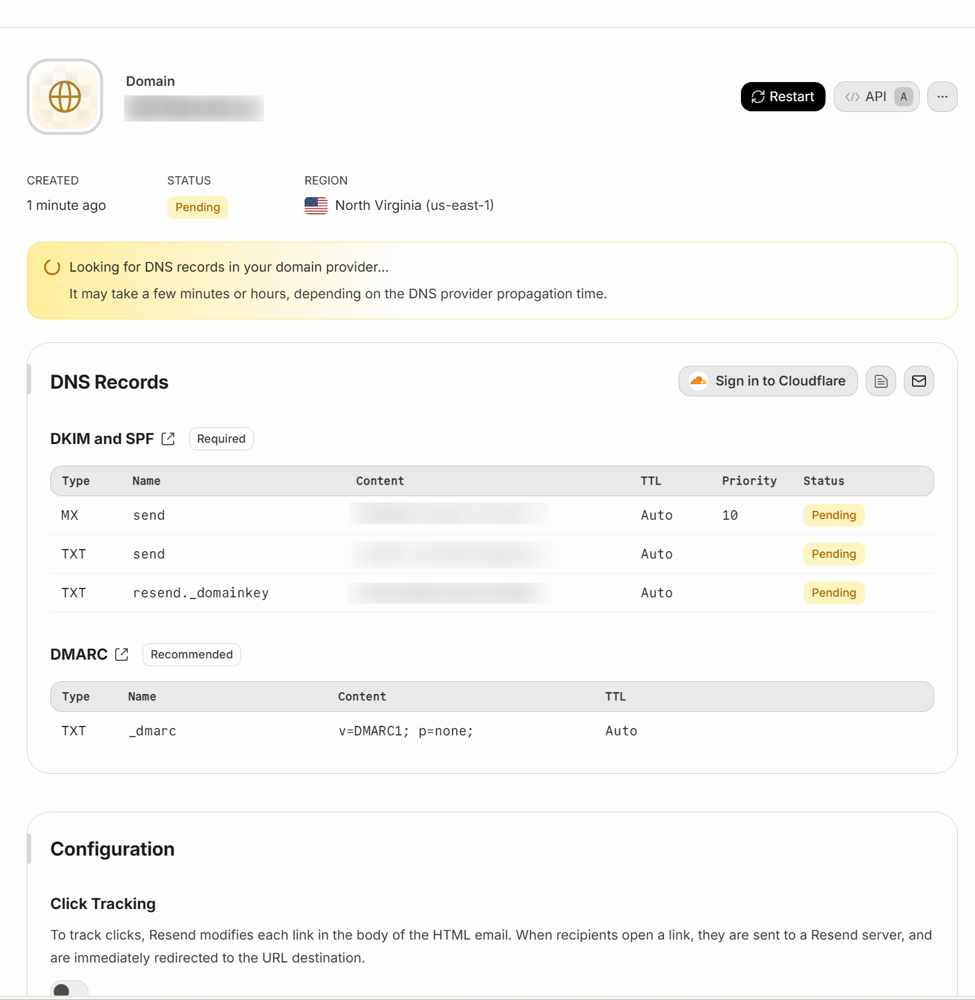

> After extensive research, I decided to use `cloudflare workers` to deploy a full-stack project. The frontend is built with `Vue`, while the backend leverages the `cloudflare workers` ecosystem along with `Hono`, `better-auth`, and `drizzle`.

## Project Initialization

### Setting up the full-stack project

```bash
npm create cloudflare@latest -- cards --framework=vue
````

After initialization, the project is already configured with `vite.config.ts`, with the frontend code organized under the `src` directory and the backend under the `server` directory.
The project is designed with the frontend as the primary part and the backend as a supporting service.

### Integrating better-auth

The purpose of this step is to use `better-auth` to manage authentication and account-related tables. The main tables include `user`, `account`, and `verification`. For session storage, we enable secondary storage using `KV` from `cloudflare workers`.
`better-auth` provides a full account management system, third-party login integrations, and a frontend SDK.

Configure the `better-auth` secret (related to password hashing, details not deeply explored here):

```properties
BETTER_AUTH_SECRET=
```

If you’re using a regular database (not `cloudflare workers` which requires binding, HTTP triggering, and context retrieval), configuring `better-auth` is quite straightforward.

Configuring the database:

```ts
import { betterAuth } from "better-auth";
import { drizzleAdapter } from "better-auth/adapters/drizzle";
import { db } from "@/db"; // your drizzle instance
 
export const auth = betterAuth({
    database: drizzleAdapter(db, {
        provider: "pg", // or "mysql", "sqlite"
    }),
});
```

Use the CLI tool to generate and migrate schema:

```bash
npx @better-auth/cli generate
npx @better-auth/cli migrate
```

Since `cloudflare workers` has its own special requirements, we use an open-source workaround: [cf-script](https://github.com/Thomascogez/cf-script) to generate schema:

```ts
import { getAdapter } from "better-auth/db";
import { writeFile } from "node:fs/promises";
import { resolve } from "node:path";
import { initBetterAuth } from "../server/lib/auth";
import { generateDrizzleSchema } from "./_vendors/drizzle-generator";

export default async (env: unknown) => {
	const betterAuth = initBetterAuth(env);

	const output = await generateDrizzleSchema({
		adapter: await getAdapter(betterAuth.options),
		options: betterAuth.options,
		file: resolve(import.meta.dirname, "../db/schema/better-auth-schemas.ts")
	});

	await writeFile(output.fileName, output.code ?? "");

	console.log(`Better auth schema generated successfully at (${output.fileName} 🎉`);
};
```

Then initialize the BetterAuth object in the global router:

```ts
// server/index.ts
type Bindings = {
  DB: D1Database; // Assuming your D1 binding is named 'DB'
  KV: KVNamespace; // Assuming your KV binding is named 'KV'
};

interface Variables {
  db: ReturnType<typeof drizzle>;
}
const app = new Hono<{ Bindings: Env; Variables: Variables }>();

app.use('*', async (c, next) => {
  const db = drizzle(c.env.DB);
  c.set('db', db);
  await next();
});
```

This sets up the `db` instance globally. Inside route handlers, you can then call the `betterAuth` instance like this:

```ts
export const auth = (env: Env): ReturnType<typeof betterAuth> => {
  const db = drizzle(env.DB);

  return betterAuth({
    ...betterAuthOptions,
    database: drizzleAdapter(drizzle(env.DB), {
      provider: "sqlite",
      schema: {
        user: schema.userTable,
        account: schema.accountTable,
        session: schema.sessionTable,
        verification: schema.verificationTable,
      },
    }),
    secondaryStorage: {
			get(key) {
				return env.KV.get(key);
			},
			set(key, value, ttl) {
				return env.KV.put(key, value, { expirationTtl: ttl });
			},
			delete(key) {
				return env.KV.delete(key);
			}
		},
    baseURL: env.BETTER_AUTH_BASE_URL,
    secret: env.BETTER_AUTH_SECRET,
    emailAndPassword: {    
      enabled: true
    },
  });
};
```

Example login route:

```ts
authRoutes.post('/login', async (c) => {
  const db = c.get('db');
  const requestBody = await c.req.json();
  const JWT_SECRET = c.env.JWT_SECRET!; 
    try {
      const { email, password, username } = requestBody;
      const loginIdentifier = email || username;
  
      if (!loginIdentifier || !password) {
        return c.json({ success: false, message: 'Email/username and password are required' }, 400);
      }

      const resp = await auth(c.env).api.signInEmail({
        body: { email: requestBody.email, password: requestBody.password }
      });

      if (resp && resp.user) {
        const user = resp.user;
        const token = await generateToken(JWT_SECRET, user.id);

        const existingUser = await db.select().from(schema.userTable).where(eq(schema.userTable.id, user.id)).limit(1).get();
  
        return c.json({
          success: true,
          message: 'Login successful',
          data: {
            user: { id: user.id, username: user.name, email: user.email },
            token
          }
        });
      }
      return c.json({ success: false, message: 'Invalid username or password' }, 400);
    } catch (error) {
      console.error('Login error:', error);
      return c.json({ success: false, message: 'Login failed, please try again later', error }, 500);
    }
});
```

Using `betterAuth` APIs like `signInEmail` and `signUpEmail` is much simpler than implementing authentication logic manually.

## Hono

As seen above, we used `Hono` for routing. Compared to raw `cloudflare workers`, `Hono` makes development smoother with robust middleware support. Its design is similar to `express`, making it convenient to implement features like authentication.

```ts
// server/middlewared/auth.ts
export const authenticateToken = async (c: Context, next: Next) => {
  const db = c.get('db');
  const JWT_SECRET = c.env.JWT_SECRET!; 
  try {
    const authHeader = c.req.header('Authorization');
    const token = authHeader?.split(' ')[1];

    if (!token) return c.json({ success: false, message: 'Access denied, token required' }, 401);
    if (!JWT_SECRET) return c.json({ success: false, message: 'Server misconfigured: missing JWT secret' }, 500);

    const decodedPayload = await verifyJWT(token, JWT_SECRET) as { userId: string };
    const user = await db.select().from(schema.userTable).where(eq(schema.userTable.id, decodedPayload.userId)).limit(1).get();

    if (!user) return c.json({ success: false, message: 'Invalid authentication token' }, 401);

    c.set('user', user);
    await next();
  } catch (error) {
    console.error('Authentication error:', error);
    if (error instanceof ExpiredTokenError) return c.json({ success: false, message: 'Token expired' }, 401);
    if (error instanceof InvalidSignatureError) return c.json({ success: false, message: 'Invalid token signature' }, 401);
    return c.json({ success: false, message: 'Internal server error' }, 500);
  }
};
```

Hono also supports [route grouping](https://hono.dev/docs/api/routing#grouping), allowing you to prefix `better-auth` routes for cleaner management:

```ts
import { Hono } from "hono";
import { auth } from "./auth";
 
const app = new Hono();
 
app.route('/api/auth', async (c) => {
    return auth.handler(c.req.raw);
});
```

The frontend can then call `/api/auth/sign-in/email` for login.

## drizzle

`drizzle` is naturally integrated into the Hono handlers since we already bound `db` globally:

```ts
app.use('*', async (c, next) => {
  const db = drizzle(c.env.DB);
  c.set('db', db);
  await next();
});
```

Then queries are straightforward:

```ts
const db = c.get('db');
const user = await db.select().from(schema.userTable).where(eq(schema.userTable.id, decodedPayload.userId)).limit(1).get();
```

Transaction operations are also supported. Normally, you can start a transaction simply by using `db.transaction`:

```ts
await db.transaction(async (tx) => {
    // Delete the user account
    await tx.delete(schema.userTable).where(eq(schema.userTable.id, userId));
    // Delete the cards created by the user
    await tx.delete(schema.cardsTable).where(eq(schema.cardsTable.userId, userId));
});
```

However, `Cloudflare Workers` with `D1` is a bit special. As suggested in this article [What's new with D1](https://blog.cloudflare.com/whats-new-with-d1/#transactions-are-a-unique-challenge), it’s recommended to use `db.batch` instead.

## Environment Variables Management

Although the [official docs](https://developers.cloudflare.com/workers/configuration/environment-variables/) explain this in detail, here’s a recommended approach:

* In development, use a `.env` file (never commit this file to source control):

```properties
BETTER_AUTH_SECRET=
BETTER_AUTH_BASE_URL=http://localhost:5173
DRIZZLE_ACCOUNT_ID=
DRIZZLE_DATABASE_ID=
DRIZZLE_TOKEN=

## jwt
JWT_SECRET=
JWT_EXPIRES_IN=

VITE_API_BASE_URL=/api
```

* In production, configure environment variables in the Cloudflare dashboard.
  Since Cloudflare Workers treats `wrangler.jsonc` or `wrangler.toml` as the single source of truth, add:

```json
keep_vars: true
```

Otherwise, deploying with `wrangler deploy` may override or remove dashboard-configured variables.

## JWT

Although Hono is used, Hono's built-in JWT solution isn't supported in the Cloudflare environment due to missing dependencies. Therefore, it's recommended to implement it yourself.

```ts
export const signJWT = async (payload: Record<string, unknown>, secret: string, expiresIn = '7d') => {
  const encoder = new TextEncoder();
  const key = await crypto.subtle.importKey(
    'raw',
    encoder.encode(secret),
    { name: 'HMAC', hash: { name: 'SHA-256' } },
    false,
    ['sign']
  );

  const header = {
    alg: 'HS256',
    typ: 'JWT'
  };

  // Calculate expiration time
  const exp = Math.floor(Date.now() / 1000) + (expiresIn === '7d' ? 7 * 24 * 60 * 60 : 3600); // Default to 7 days expiration

  const payloadWithExp = { ...payload, exp };

  const headerBase64 = base64UrlEncode(JSON.stringify(header));
  const payloadBase64 = base64UrlEncode(JSON.stringify(payloadWithExp));

  // Sign
  const data = `${headerBase64}.${payloadBase64}`;
  const signatureBuffer = await crypto.subtle.sign('HMAC', key, new TextEncoder().encode(data));
  const signatureBase64 = base64UrlEncode(String.fromCharCode(...new Uint8Array(signatureBuffer)));

  return `${data}.${signatureBase64}`;
};

// Encode
const base64UrlEncode = (str: string) => {
  return btoa(String.fromCharCode(...new TextEncoder().encode(str)))
    .replace(/=/g, '')
    .replace(/\+/g, '-')
    .replace(/\//g, '_');
};

export const verifyJWT = async (token: string, secret: string) => {
  const [headerBase64, payloadBase64, signatureBase64] = token.split('.');
  const encoder = new TextEncoder();
  const key = await crypto.subtle.importKey(
    'raw',
    encoder.encode(secret),
    { name: 'HMAC', hash: { name: 'SHA-256' } },
    false,
    ['verify', 'sign']
  );

  const data = `${headerBase64}.${payloadBase64}`;

  // Decode signature
  const signatureBuffer = await crypto.subtle.sign(
    'HMAC',
    key,
    new TextEncoder().encode(data)
  );

  const computedSignatureBase64 = base64UrlEncode(String.fromCharCode(...new Uint8Array(signatureBuffer)));

  // Verify signature match
  if (computedSignatureBase64 !== signatureBase64) {
    throw new InvalidSignatureError('Invalid signature');
  }

  // Verify expiration time
  const payload = JSON.parse(atob(payloadBase64));
  const currentTime = Math.floor(Date.now() / 1000);
  if (payload.exp && payload.exp < currentTime) {
    throw new ExpiredTokenError('Token has expired');
  }

  return payload;
};
```

## Email Functionality

The email functionality is an essential part of the website registration process, used to verify users' email addresses. After integrating `better-auth`, the capabilities for sending emails and token verification are available, but some adjustments are still needed to implement them in our project.

### Integrating Resend

We use the `Resend` service for email sending capabilities. First, you need to register for the Resend service, then add a domain in Resend. If your domain is managed on `Cloudflare`, by authorizing Resend, Resend will automatically add the relevant domain configurations on Cloudflare.

Add a domain,


Configure DNS MX records and TXT records,


### Integration with better-auth

First, you need to enable email verification. Refer to the documentation [require-email-verification](https://www.better-auth.com/docs/authentication/email-password#require-email-verification)

```ts
  emailVerification: {
    sendVerificationEmail: async ({ user, token }) => {
      await sendEmail(user.email, token, env.BETTER_AUTH_BASE_URL, env.RESEND_API_KEY);
    },
    sendOnSignUp: true,
    autoSignInAfterVerification: true,
    expiresIn: 3600 * 24 // 24 hours
  },
```

#### About sendOnSign

The reason this option is emphasized is that it is the key to actually enabling email verification. The official documentation [require-email-verification](https://www.better-auth.com/docs/authentication/email-password#require-email-verification)

```ts
export const auth = betterAuth({
  emailAndPassword: {
    requireEmailVerification: true,
  },
});
```

doesn't actually work (suspected bug or caused by project configuration).

The correct solution is to set `sendOnSignUp: true`, but the official documentation notes that this will send an email every time `signUpEmail` is called. The solution is to return to the business logic and control that an email is not registered twice.

#### Implementing the sendEmail method

Since it runs in the `Cloudflare Workers` environment, you can't get the Resend API key from `process.env.RESEND_API_KEY` like in a regular Node.js project. Here, we choose to pass the `env.RESEND_API_KEY` variable from the better-auth options configuration.

A simple email sending function is as follows:

```ts
import { Resend } from "resend"

export async function sendEmail(to: string, token: string, BETTER_AUTH_BASE_URL: string, RESEND_API_KEY: string) {
  const resend = new Resend(RESEND_API_KEY);
  
  const emailHtml = `<a href="${BETTER_AUTH_BASE_URL}/verify?token=${token}" >Click to verify your email</a>`;

  const { data, error } = await resend.emails.send({
    from: "noreply@sandural.cc",
    to,
    subject: "Verify your email",
    html: emailHtml,
  });
  
  if (error) {
    console.error("Failed to send email", error);
    throw new Error("Email send failed");
  }
  
  console.log("Email sent", data);
  return data;
}
```

However, this provides a poor user experience. It's better to rewrite the email content into rich text using AI to create a concise and beautiful email body.

#### Verifying the token

Clicking the email verification link `${BETTER_AUTH_BASE_URL}/verify?token=${token}` won't directly call the backend API. Instead, it will first try to open the frontend project, as any link opened in the browser is managed by the project's Vue router.

Therefore, we need to add a frontend route and Vue page: `/verify` -> `Verify.Vue`, and then call the backend API in this Vue page.

The backend API implementation is relatively simple: get the `better-auth` instance from the Cloudflare Workers context and call its `verifyEmail` API capability.

```ts
const result = await c.var.auth.api.verifyEmail({
  query: { token },
});
```

#### Resending email verification

The token on the email verification link is valid for 24 hours. If the user forgets or doesn't receive it, they can choose to resend it. Considering that resending might cause resource waste, the project has a daily limit on the number of resends.

The frontend calls the `/api/auth/resend-email` interface, which checks the user's login status before calling the `better-auth` `sendVerificationEmail` API.

```ts
// better-auth will regenerate and send a new email
const result = await c.var.auth.api.sendVerificationEmail({
  body: { email: user.email }
});
```

## Image Hosting Functionality

For the image hosting functionality, we use Cloudflare Workers' `R2`. The chosen solution is to upload via Cloudflare Workers binding, access via public URLs, and use a custom domain.

### Image Upload Functionality

```ts
const formData = await c.req.formData();
const file = formData.get('file') as File;
const fileKey = getFileKey(user.id, file.name);
// Upload to R2
const putResult = await c.env.R2.put(fileKey, file.stream(), {
  httpMetadata: {
    contentType: file.type,
  },
  customMetadata: {
    uploadedBy: user.id,
  },
});
return c.json({
  success: true,
  message: 'File uploaded successfully',
  fileUrl: `${c.env.R2_BUCKET_DOMAIN}/${fileKey}`
});
```

In the production environment, after successful image upload, the frontend receives a URL similar to `https://i.sandural.cc/bhES2ttw9pHJvXYKKmzpo3MwDHnB/1756229492767-deepseek_mermaid_20250826_a901ed.png`

In development (`dev`) mode, image resources are not actually uploaded to the cloud server but are stored in the `.wrangler/state/v3/r2` directory. To properly display images in `dev` mode, handle it as follows:

```
R2_BUCKET_DOMAIN=http://localhost:5173/images
```

Then add a backend route `/images/:key{.+}`, and read the stream from the R2 object storage using the `key` and return it.

```ts
const key = c.req.param("key")
const obj = await c.env.R2.get(key)
if (!obj) return c.text("Not found", 404)

return new Response(obj.body, {
  headers: {
    "Content-Type": obj.httpMetadata?.contentType ?? "application/octet-stream",
  },
})
```

### Notes

Since we use public URL access, the `*.r2.dev` subdomains provided by Cloudflare are basically inaccessible in China, so you must use your own independent domain, and a subdomain configuration is sufficient.

Additionally, due to public URL access, it's recommended to properly configure CORS to prevent exceeding traffic limits.

Configuration reference


## Troubleshooting

Since better-auth manages login state based on the session-cookie scheme, problems may occur if it's not fully supported as required.

For example, when changing passwords, missing or incorrect cookies in the request headers can cause failure to retrieve the session in the internal implementation of `changePassword`, ultimately leading to API call failure.

```ts
    const response = await auth.api.changePassword({
      body: {
        currentPassword,
        newPassword,
        revokeOtherSessions: true,
      },
      headers: c.req.raw.headers,
      asResponse: true,
    }).catch((error) => {
      console.error('Change password error:', error);
      return c.json({
        success: false,
        message: 'Current password is incorrect'
      }, 401);
    })
```

The solution is to manually set the cookie during login and then pass accurate headers when changing the password.

### Setting cookies during login

```ts
const response = await auth.api.signInEmail({
  body: {
    email: requestBody.email,
    password: requestBody.password,
  },
  asResponse: true
})
responseCookies(c, response);

export function responseCookies(c: Context, response: Response) {
  // console.log('Login response headers:', response.headers);
  const cookie = response.headers.get('Set-Cookie')?.split(';')[0].split('=')[1] || ''
  // console.log('Extracted cookie:', cookie);
  setCookie(c, 'better-auth.session_token', cookie,
    {
      httpOnly: true, secure: true, sameSite: 'Lax', path: '/'
      , maxAge: 7 * 24 * 60 * 60 // 7 days
    })
}
```

### Passing headers when changing passwords

Since cookies contain special characters like %, it's necessary to preprocess the request headers.

```ts
const cookie = decodeURIComponent(c.req.header('Cookie') || '')
const headers = new Headers(c.req.raw.headers);
headers.set('Cookie', cookie);

// ...
const response = await auth.api.changePassword({
  body: {
    currentPassword,
    newPassword,
    revokeOtherSessions: true,
  },
  headers: headers,
  asResponse: true,
})
```

Also, don't forget to update the cookie after a successful password change:

```ts
responseCookies(c, response);
```

## References

* [cloudflare workers](https://developers.cloudflare.com/)
* [cloudflare workers vue](https://developers.cloudflare.com/workers/framework-guides/web-apps/vue/)
* [cloudflare workers d1](https://developers.cloudflare.com/d1/)
* [cloudflare workers kv](https://developers.cloudflare.com/kv/)
* [Hono](https://hono.dev)
* [better-auth](https://www.better-auth.com/)
* [drizzle](https://orm.drizzle.team/)
* [cf-script](https://github.com/Thomascogez/cf-script)
* [Resend](https://resend.com/)

