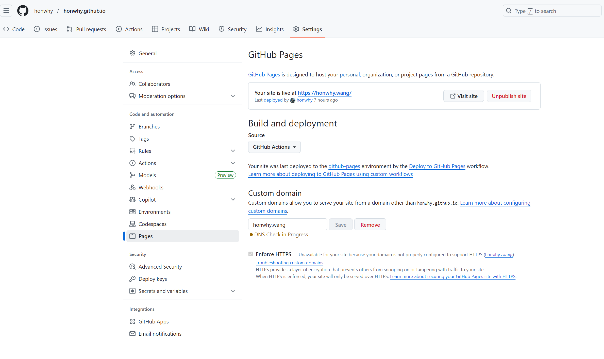
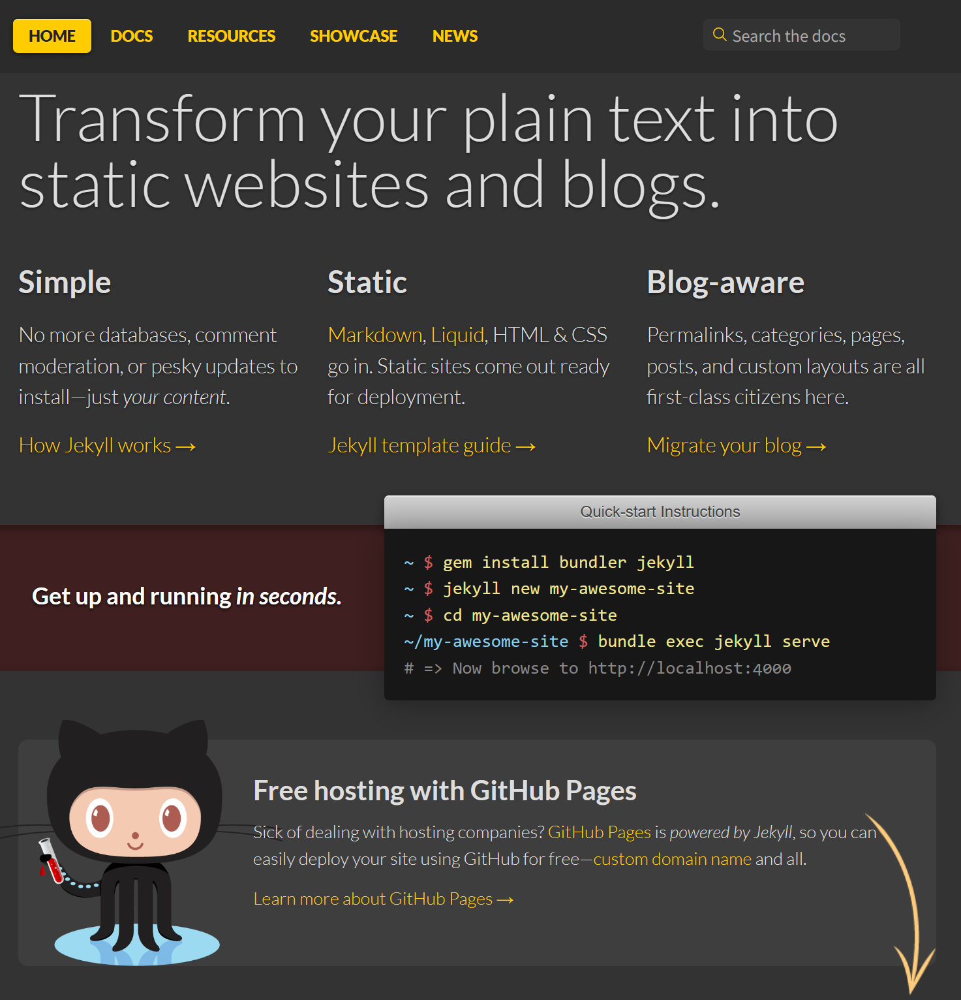
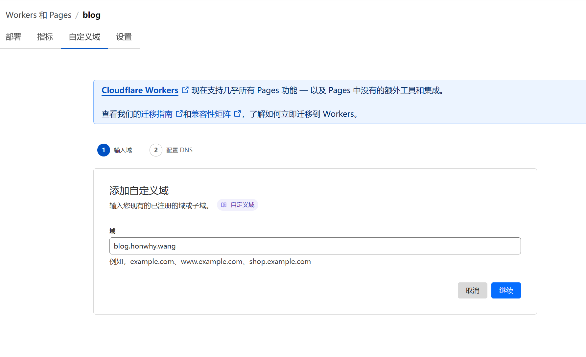

> 使用GitHub Pages和Cloudflare Pages搭建静态网站，非常适合个人独立博客及公司产品宣传页面。


GitHub Pages刚推出时曾让人耳目一新——当大家还在折腾WordPress、调试各类主题时，静态网页技术的回归在部分场景下实现了**更快的响应速度与更优的用户体验**。用户只需创建与GitHub账号同名的仓库（如`honwhy.github.io`），上传静态网页文件，即可通过`honwhy.github.io`访问网站内容。

若添加CNAME配置，还能通过自定义域名访问：例如将`honwhy.wang`通过CNAME解析到`honwhy.github.io`，即可用`honwhy.wang`打开网站。


## 传统搭建方式（GitHub Pages）
1. 新建与GitHub账号同名的`*.github.io`仓库（如`username.github.io`）；
2. 上传静态网站内容，确保根目录包含入口文件`index.html`；
3. 在仓库设置中开启Pages服务，选择部署分支，完成静态网站搭建。




## 框架支持（GitHub Pages）
### 官方原生支持：Jekyll
笔者最开始便采用此方案搭建网站。**原生支持**是Jekyll的核心优势——只需在仓库中管理Jekyll项目源码，源码更新后GitHub会自动触发编译与部署，无需手动操作。

缺点是Jekyll基于Ruby开发，在Windows环境下运行易出现依赖兼容问题，建议通过**WSL（Windows子系统）** 运行项目。

参考文档：[Jekyll](https://jekyllrb.com/)



### 主流静态网站生成器
随着技术发展，多款更易上手的静态生成器陆续出现，相比Jekyll更适配Windows环境，且基于Node.js/Go等主流技术栈，对前端开发者更友好。凭借前端工程师的持续创造力，这类框架的功能与生态也愈发丰富：
- **Hexo**：基于Node.js开发，曾是独立博客的热门选择，主题样式丰富（参考：[Hexo](https://hexo.io)）；
- **Hugo**：基于Go语言开发，以**构建速度快、性能强**为核心优势（参考：[Hugo](https://gohugo.io/)）。

### 新兴选择：Astro
Astro相比传统静态生成器，最大优势在于**主题维护的灵活性**。它支持React、Vue等主流SPA框架，可通过编写组件定义页面布局与样式，比Hexo主题开发更自由。

Astro既适合制作落地页（Landing Page），也可用于搭建独立博客，是当前静态网站开发的热门框架。


## 辅助工具：Gridea
以[Gridea](https://open.gridea.dev/)为代表的桌面工具，可简化GitHub Pages的搭建流程：
1. 通过Gridea创建博客、编写Markdown文章；
2. 授权GitHub Token（无需手动操作仓库）；
3. 工具自动将Markdown内容编译为静态文件，并推送至GitHub仓库。

核心优势：**简化GitHub仓库配置**，无需手动管理分支、编译命令，新手友好。


## 部署流程的演进（GitHub Pages）
### 1. 无感知部署（自动编译）
- 若使用Jekyll：仅需完成网站配置与Markdown编写，后续编译、部署由GitHub自动处理；
- 若使用Hexo：本地编译后，仅推送构建产物到GitHub（建议采用强制推送），无需额外部署操作。

### 2. 分支管理（源码与产物分离）
适用于需保留源码的场景：
1. 本地用Hexo开发，将**源码**推送到GitHub仓库的指定分支（如`main`分支）；
2. 通过GitHub Actions监听`main`分支的推送事件，自动执行Hexo构建；
3. 将构建产物强制推送到仓库的`gh-pages`分支（GitHub Pages默认部署该分支）。

此方案需保留两个分支：`main`（源码）、`gh-pages`（构建产物）。

### 3. GitHub Actions简化部署（通用方案）
无论使用Jekyll、Hexo还是Astro，均可通过GitHub Actions实现“源码推送→自动编译→部署”的全流程自动化。编译完成后，将产物推送至GitHub Pages指定的URL即可。

示例配置（Astro项目）：
```yml
name: Deploy to GitHub Pages

on:
  # 推送main分支时触发 workflow
  push:
    branches: [main]
  # 支持手动触发（GitHub Actions页面）
  workflow_dispatch:

# 权限配置（允许读取源码、部署Pages）
permissions:
  contents: read
  pages: write
  id-token: write

jobs:
  build:
    runs-on: ubuntu-latest
    steps:
      # 拉取仓库源码
      - name: Checkout repository
        uses: actions/checkout@v4
      # 安装依赖、构建Astro项目并上传产物
      - name: Install & build Astro
        uses: withastro/action@v2
        with:
          package-manager: pnpm@9.0.5
        # 可选配置（根据项目调整）
        # path: . # Astro项目根目录（默认当前目录）
        # node-version: 20 # Node版本（默认18）
        # package-manager: pnpm@latest # 包管理器（自动识别锁文件）

  deploy:
    needs: build # 依赖build任务完成
    runs-on: ubuntu-latest
    environment:
      name: github-pages
      url: ${{ steps.deployment.outputs.page_url }} # 部署后URL
    steps:
      # 部署到GitHub Pages
      - name: Deploy to GitHub Pages
        id: deployment
        uses: actions/deploy-pages@v4
```


## Cloudflare Pages搭建方案
Cloudflare Pages是Cloudflare推出的静态网站托管服务，相比GitHub Pages，在**全球CDN加速、自定义域名配置**等方面更具优势，部署流程也更灵活。

### 1. 简单部署（直接连接GitHub）
Cloudflare Pages的配置流程更友好，无需手动编写Actions：
1. 登录Cloudflare控制台，进入Pages服务，选择“连接GitHub仓库”；
2. 选择目标仓库，配置框架（如Astro、Hexo）、编译命令（如`pnpm build`）、静态产物目录（如`./dist`）；
3. 保存配置后，GitHub仓库代码变动时会自动触发Cloudflare的编译与部署。


### 2. 结合GitHub Actions部署（源码预编译）
若已通过GitHub Actions完成源码编译（如前面的Astro构建流程），可直接将构建产物推送到Cloudflare Pages，减少重复编译步骤，提升部署速度。

示例配置（仅保留“构建→推送Cloudflare”流程）：
```yml
name: Deploy to Cloudflare Pages # 修正原配置的名称（避免误导）

on:
  push:
    branches: [main]
  workflow_dispatch:

permissions:
  contents: read # 仅需读取源码权限

jobs:
  build-and-deploy:
    runs-on: ubuntu-latest
    steps:
      # 拉取仓库源码
      - name: Checkout repository
        uses: actions/checkout@v4
      # 构建Astro项目
      - name: Install & build Astro
        uses: withastro/action@v2
        with:
          package-manager: pnpm@9.0.5
      # 推送构建产物到Cloudflare Pages
      - name: Deploy to Cloudflare Pages
        uses: cloudflare/pages-action@v1
        with:
          apiToken: ${{ secrets.CLOUDFLARE_API_TOKEN }} # Cloudflare API Token
          accountId: ${{ secrets.CLOUDFLARE_ACCOUNT_ID }} # Cloudflare账号ID
          projectName: blog # Cloudflare Pages项目名
          directory: ./dist # 静态产物目录（与框架配置一致）
```

结合前文，可以看出来通过github action 是可以同时部署两个环境的，比如笔者的博客，同时部署Github Pages和 Cloudflare Pages，可以分别通过`honwhy.wang` 和 `blog.honwhy.wang` 进行访问。

#### 配置说明：
1. 先在Cloudflare控制台创建Pages项目（如命名为`blog`），参考下图：
   
2. 生成Cloudflare API Token与Account ID（需授予Pages部署权限）；
3. 在GitHub仓库的“Settings → Secrets and variables → Actions”中，添加`CLOUDFLARE_API_TOKEN`和`CLOUDFLARE_ACCOUNT_ID`两个密钥，对应Cloudflare的凭证。
   

### 3. Cloudflare官方推荐的Actions工具
注意：上述配置中使用的`cloudflare/pages-action`已被标记为弃用。  
Cloudflare官方当前推荐使用`wrangler-actions`，支持更丰富的部署功能（如环境变量配置、预览部署）。

参考文档：[Use Direct Upload with continuous integration](https://developers.cloudflare.com/pages/how-to/use-direct-upload-with-continuous-integration/#get-credentials-from-cloudflare)


## 域名映射（CNAME配置差异）
GitHub Pages与Cloudflare Pages的CNAME处理逻辑不同，需注意区分：

### GitHub Pages的CNAME配置
GitHub Pages要求项目中必须包含`CNAME`文件（无后缀），文件内容为自定义域名（如`honwhy.wang`），否则自定义域名访问会返回404错误。

#### 配置方式：
- 若直接托管静态产物：在产物根目录放置`CNAME`文件；
- 若通过GitHub Actions部署：确保`gh-pages`分支的根目录有`CNAME`文件（可在框架的`public`目录中提前放置`CNAME`，编译时会自动复制到产物目录；或在Actions中通过Linux命令创建，如`echo "honwhy.wang" > ./dist/CNAME`）。

### Cloudflare Pages的CNAME配置
Cloudflare Pages不依赖项目中的`CNAME`文件，建议通过以下方式配置自定义域名：
1. 将自定义域名的DNS解析托管到Cloudflare；
2. 进入Cloudflare Pages项目的“自定义域”设置，添加目标域名并完成验证；
3. Cloudflare会自动配置解析记录，无需手动管理CNAME文件。




## 参考文档
- [Jekyll](https://jekyllrb.com/)（GitHub Pages官方支持框架）
- [Hexo](https://hexo.io/)（Node.js静态生成器）
- [Hugo](https://gohugo.io/)（高性能Go语言静态生成器）
- [Astro](https://astro.build/)（现代化静态/SSR框架）
- [Gridea](https://open.gridea.dev/)（静态博客辅助工具）
- [Cloudflare Pages Direct Upload（官方文档）](https://developers.cloudflare.com/pages/how-to/use-direct-upload-with-continuous-integration/#get-credentials-from-cloudflare)