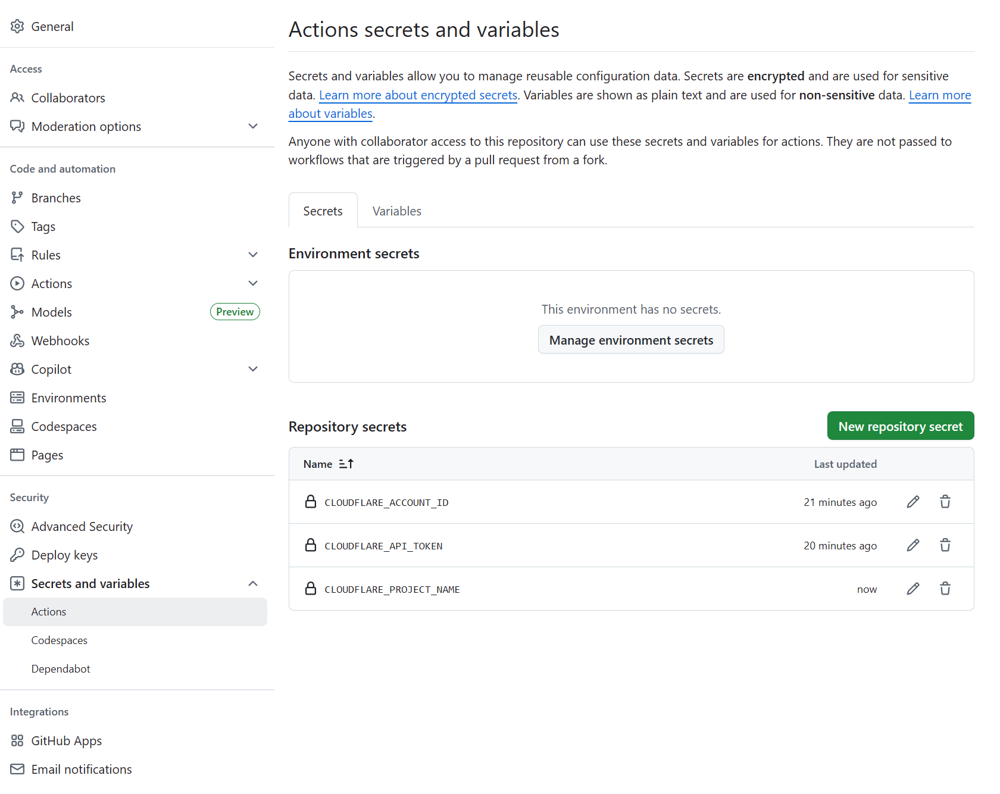

> Building a static website with GitHub Pages and Cloudflare Pages is ideal for personal independent blogs and company product showcase pages.


When GitHub Pages first came out, it was a total eye-opener — while everyone else was still messing with WordPress and tweaking various themes, the return of static web technology delivered **faster load times and better user experiences** in certain scenarios. All you need to do is create a repo with the same name as your GitHub account (like `honwhy.github.io`), upload your static files, and you can access your site at `honwhy.github.io`.

If you add a CNAME configuration, you can also use a custom domain: for example, point `honwhy.wang` to `honwhy.github.io` via a CNAME record, and you’ll be able to open your site at `honwhy.wang`.


## Traditional Setup Method (GitHub Pages)
1. Create a new `*.github.io` repo with the same name as your GitHub account (e.g., `username.github.io`);
2. Upload your static website files, making sure the root directory includes the entry file `index.html`;
3. Enable the Pages service in your repo settings, select a deployment branch, and your static site will be ready.


## Framework Support (GitHub Pages)
### Official Native Support: Jekyll
I initially used this solution to build my site. **Native support** is Jekyll’s biggest advantage — you just manage your Jekyll project’s source code in the repo, and when you update the code, GitHub automatically triggers compilation and deployment with no manual work needed.

The downside? Jekyll is built on Ruby, so it often runs into dependency compatibility issues on Windows. It’s recommended to run the project via **WSL (Windows Subsystem for Linux)** instead.

Reference: [Jekyll](https://jekyllrb.com/)


### Popular Static Site Generators
As technology has evolved, several more user-friendly static generators have popped up. Compared to Jekyll, they’re more compatible with Windows and built on popular tech stacks like Node.js/Go — making them way friendlier for front-end developers. Thanks to front-end engineers’ ongoing creativity, these frameworks’ features and ecosystems have grown more robust too:
- **Hexo**: Built on Node.js, it was once a go-to for independent blogs, with tons of themes (Reference: [Hexo](https://hexo.io));
- **Hugo**: Built on Go, its main selling points are **blazing-fast build times and strong performance** (Reference: [Hugo](https://gohugo.io/)).

### Emerging Option: Astro
Compared to traditional static generators, Astro’s biggest edge is **flexibility in theme maintenance**. It supports popular SPA frameworks like React and Vue, letting you define page layouts and styles by writing components — giving you more freedom than Hexo theme development.

Astro works great for both landing pages and independent blogs, making it a hot pick for static site development right now.


## Auxiliary Tool: Gridea
Desktop tools like [Gridea](https://open.gridea.dev/) simplify the GitHub Pages setup process:
1. Create a blog and write Markdown articles directly in Gridea;
2. Authorize your GitHub Token (no need to mess with the repo manually);
3. The tool automatically compiles Markdown into static files and pushes them to your GitHub repo.

Key Advantage: **Simplifies GitHub repo configuration** — no manual branch management or build commands required, so it’s perfect for beginners.


## Evolution of Deployment Workflows (GitHub Pages)
### 1. Seamless Deployment (Automatic Compilation)
- For Jekyll: Just configure your site and write Markdown — GitHub handles compilation and deployment automatically afterward;
- For Hexo: After compiling locally, just push the build output to GitHub (force push is recommended) — no extra deployment steps needed.

### 2. Branch Management (Separate Source Code & Build Output)
Great for scenarios where you need to keep your source code:
1. Develop locally with Hexo, then push your **source code** to a specific branch in your GitHub repo (e.g., the `main` branch);
2. Use GitHub Actions to monitor push events on the `main` branch and run Hexo builds automatically;
3. Force push the build output to the repo’s `gh-pages` branch (GitHub Pages’ default deployment branch).

This setup requires two branches: `main` (source code) and `gh-pages` (build output).

### 3. Simplified Deployment with GitHub Actions (Universal Solution)
Whether you’re using Jekyll, Hexo, or Astro, you can use GitHub Actions to automate the entire workflow: *Push Source Code → Auto Compile → Deploy*. Once compilation finishes, just push the output to the URL specified by GitHub Pages.

Example configuration (Astro project):
```yml
name: Deploy to GitHub Pages

on:
  # Trigger workflow when pushing to the main branch
  push:
    branches: [main]
  # Allow manual triggering (via the GitHub Actions page)
  workflow_dispatch:

# Permission setup (allow reading source code and deploying Pages)
permissions:
  contents: read
  pages: write
  id-token: write

jobs:
  build:
    runs-on: ubuntu-latest
    steps:
      # Pull repo source code
      - name: Checkout repository
        uses: actions/checkout@v4
      # Install dependencies, build the Astro project, and upload output
      - name: Install & build Astro
        uses: withastro/action@v2
        with:
          package-manager: pnpm@9.0.5
        # Optional configuration (adjust based on your project)
        # path: . # Astro project root (current directory by default)
        # node-version: 20 # Node version (18 by default)
        # package-manager: pnpm@latest # Package manager (auto-detects lock file)

  deploy:
    needs: build # Depends on the build job to complete
    runs-on: ubuntu-latest
    environment:
      name: github-pages
      url: ${{ steps.deployment.outputs.page_url }} # URL after deployment
    steps:
      # Deploy to GitHub Pages
      - name: Deploy to GitHub Pages
        id: deployment
        uses: actions/deploy-pages@v4
```


## Cloudflare Pages Setup Solution
Cloudflare Pages is a static hosting service from Cloudflare. Compared to GitHub Pages, it has better **global CDN acceleration** and **custom domain configuration**, plus a more flexible deployment workflow.

### 1. Simple Deployment (Direct GitHub Connection)
Cloudflare Pages has a way more user-friendly setup — no need to write Actions manually:
1. Log in to the Cloudflare dashboard, go to the Pages service, and select "Connect GitHub Repository";
2. Choose your target repo, then configure the framework (e.g., Astro, Hexo), build command (e.g., `pnpm build`), and static output directory (e.g., `./dist`);
3. After saving, any code changes in your GitHub repo will automatically trigger compilation and deployment on Cloudflare.


### 2. Deployment with GitHub Actions (Source Code Precompilation)
If you’ve already compiled your source code via GitHub Actions (like the Astro build workflow above), you can push the build output directly to Cloudflare Pages. This cuts down on redundant compilation steps and speeds up deployment.

Example configuration (only keeps the "Build → Push to Cloudflare" workflow):
```yml
name: Deploy to Cloudflare Pages # Correct the original config name (avoids confusion)

on:
  push:
    branches: [main]
  workflow_dispatch:

permissions:
  contents: read # Only need permission to read source code

jobs:
  build-and-deploy:
    runs-on: ubuntu-latest
    steps:
      # Pull repo source code
      - name: Checkout repository
        uses: actions/checkout@v4
      # Build the Astro project
      - name: Install & build Astro
        uses: withastro/action@v2
        with:
          package-manager: pnpm@9.0.5
      # Push build output to Cloudflare Pages
      - name: Deploy to Cloudflare Pages
        uses: cloudflare/pages-action@v1
        with:
          apiToken: ${{ secrets.CLOUDFLARE_API_TOKEN }} # Cloudflare API Token
          accountId: ${{ secrets.CLOUDFLARE_ACCOUNT_ID }} # Cloudflare Account ID
          projectName: blog # Cloudflare Pages project name
          directory: ./dist # Static output directory (matches framework config)
```

As we saw earlier, you can use GitHub Actions to deploy to two environments at once. For example, my blog is deployed to both GitHub Pages and Cloudflare Pages — so it’s accessible at `honwhy.wang` and `blog.honwhy.wang` respectively.

#### Configuration Notes:
1. First, create a Pages project in the Cloudflare dashboard (e.g., name it `blog`), as shown below:
   
2. Generate a Cloudflare API Token and Account ID (make sure to grant Pages deployment permissions);
3. In your GitHub repo’s "Settings → Secrets and variables → Actions", add two secrets: `CLOUDFLARE_API_TOKEN` and `CLOUDFLARE_ACCOUNT_ID` (these match your Cloudflare credentials).
   

### 3. Cloudflare’s Officially Recommended Actions Tool
Note: The `cloudflare/pages-action` used in the config above has been marked as deprecated.  
Cloudflare now recommends using `wrangler-actions` instead, which supports more features like environment variable configuration and preview deployments.

Reference: [Use Direct Upload with continuous integration](https://developers.cloudflare.com/pages/how-to/use-direct-upload-with-continuous-integration/#get-credentials-from-cloudflare)


## Domain Mapping (CNAME Configuration Differences)
GitHub Pages and Cloudflare Pages handle CNAMEs differently — here’s what you need to know:

### CNAME Configuration for GitHub Pages
GitHub Pages requires your project to have a `CNAME` file (no extension) with your custom domain (e.g., `honwhy.wang`) as its content. Without this file, accessing your site via the custom domain will return a 404 error.

#### Configuration Methods:
- If hosting static output directly: Place the `CNAME` file in the root directory of the output;
- If deploying via GitHub Actions: Ensure the `gh-pages` branch’s root directory has the `CNAME` file. You can either:
  - Pre-place the `CNAME` file in your framework’s `public` directory (it’ll auto-copy to the output during compilation), or
  - Create it via a Linux command in Actions (e.g., `echo "honwhy.wang" > ./dist/CNAME`).

### CNAME Configuration for Cloudflare Pages
Cloudflare Pages doesn’t rely on a `CNAME` file in your project. We recommend configuring your custom domain like this:
1. Host your custom domain’s DNS resolution on Cloudflare;
2. Go to your Cloudflare Pages project’s "Custom Domains" settings, add your target domain, and complete verification;
3. Cloudflare will auto-configure the DNS records — no need to manage a CNAME file manually.


## Reference Documents
- [Jekyll](https://jekyllrb.com/) (Officially supported framework for GitHub Pages)
- [Hexo](https://hexo.io/) (Node.js-based static site generator)
- [Hugo](https://gohugo.io/) (High-performance Go-based static site generator)
- [Astro](https://astro.build/) (Modern static/SSR framework)
- [Gridea](https://open.gridea.dev/) (Auxiliary tool for static blogs)
- [Cloudflare Pages Direct Upload (Official Docs)](https://developers.cloudflare.com/pages/how-to/use-direct-upload-with-continuous-integration/#get-credentials-from-cloudflare)