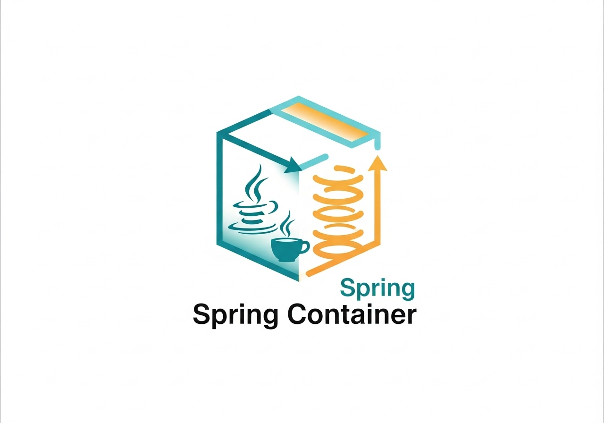

## How to Implement Sensitive Component Dependency Detection in Spring



### Background: Spring Bean Lifecycle and Dependency Injection

In the Spring Framework, **Bean lifecycle management** is one of its core features. When the Spring container starts up, it performs the following steps:

* Scans and registers all classes annotated with `@Component` and similar annotations as Beans
* Resolves Bean dependencies (e.g., via `@Autowired` or `@Resource`)
* Instantiates Beans and injects their dependencies
* Invokes initialization callbacks at the appropriate lifecycle stage

While this mechanism is powerful, it can also introduce **security or architectural issues**. For instance, some components might contain **sensitive logic** (such as encryption, authentication, or permission control) that should not be freely accessed or injected into arbitrary Beans.

To manage this risk, we need a mechanism that can **detect and prevent illegal dependencies** during the Spring startup process.

---

### Objective and Use Cases

The purpose of the `SensitiveDependencyValidator` is to **detect illegal dependencies on sensitive components during the Spring application startup phase**, and to **terminate the startup process** if any violations are found.

This kind of validation serves several key purposes:

1. **Security** – Prevent unauthorized access to critical business logic
2. **Architectural Compliance** – Ensure that the system follows established design and dependency directions
3. **Risk Control** – Avoid data leaks or misuse of functionality caused by improper dependencies

---

### Detailed Implementation

#### 1. Define a Sensitive Component Marker

First, define a custom annotation `@SensitiveComponent` to mark Beans that should be treated as sensitive:

```java
@Target(ElementType.TYPE)
@Retention(RetentionPolicy.RUNTIME)
public @interface SensitiveComponent {
}
```

Then, annotate any protected or security-critical service with it:

```java
@SensitiveComponent
@Component
public class SecretService {
    // Sensitive operations...
}
```

---

#### 2. Implement the Dependency Validator

Create a configuration class that implements `SmartInitializingSingleton`.
This ensures that your validation logic runs **after all singleton Beans have been instantiated**:

```java
@Configuration
public class SensitiveDependencyValidator 
        implements SmartInitializingSingleton, BeanFactoryAware {
    
    private ConfigurableListableBeanFactory beanFactory;
    
    @Override
    public void setBeanFactory(BeanFactory beanFactory) throws BeansException {
        this.beanFactory = (ConfigurableListableBeanFactory) beanFactory;
    }
    
    @Override
    public void afterSingletonsInstantiated() {
        // Find all Beans annotated with @SensitiveComponent
        Map<String, Class<?>> sensitiveBeans = findAllSensitiveBeans();
        
        // Check whether other Beans depend on these sensitive Beans
        List<String> violations = checkDependencies(sensitiveBeans);
        
        if (!violations.isEmpty()) {
            throw new IllegalStateException(
                "Illegal dependencies detected:\n" + String.join("\n", violations));
        }
    }
}
```

---

#### 3. Core Detection Logic

The core process involves **collecting sensitive Beans** and **iterating through all Beans** to check for invalid dependencies:

```java
// Pseudocode
function findAllSensitiveBeans():
    beans = getAllBeans()
    result = emptyMap()
    for each (name, bean) in beans:
        clazz = getTargetClass(bean)
        if clazz.hasAnnotation(SensitiveComponent):
            result[name] = clazz
    return result

function checkDependencies(sensitiveBeans):
    violations = emptyList()
    for each beanName in getAllBeanNames():
        dependencies = getDependenciesForBean(beanName)
        for each dep in dependencies:
            if sensitiveBeans.containsKey(dep):
                violations.add(formatViolation(beanName, dep))
    return violations
```

In the actual implementation, we can leverage Spring’s built-in APIs:

* Use `AopUtils.getTargetClass()` to obtain the real (non-proxy) class of a Bean
* Use `beanFactory.getBeansOfType(Object.class)` to retrieve all Beans
* Use `beanFactory.getDependenciesForBean()` to analyze dependency relationships

---

#### 4. Example: Illegal Dependency

Consider the following example where a regular business service attempts to inject a sensitive service:

```java
@Component
public class BusinessService {
    @Resource
    private SecretService secretService; // Illegal dependency!
}
```

During Spring startup, the `SensitiveDependencyValidator` will detect this and throw an exception:

```
❌ Sensitive dependency detected, Spring startup aborted:
  businessService depends on sensitive Bean [secretService:SecretService]
```

---

### Summary

This approach leverages Spring’s **extension points** to implement a **static dependency validation** mechanism without interfering with the normal application flow.

Compared to runtime dynamic checks, this method **exposes issues earlier in the startup phase**, improving the **robustness** and **compliance** of the system.

Moreover, since it’s built entirely on **standard Spring mechanisms**, it’s **easy to integrate**, **low-maintenance**, and **framework-agnostic**—making it an elegant solution for enforcing dependency constraints in large-scale enterprise applications.

